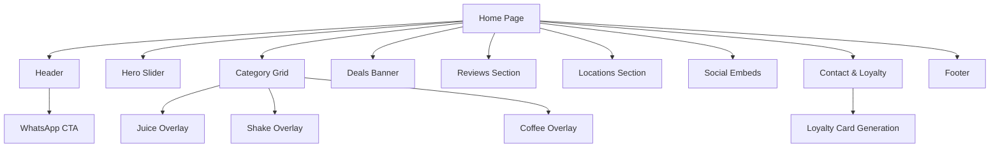

This document provides a comprehensive overview of the **2Go Fresh Beverage Brand** website, including its architecture, user journey, functional logic, and design philosophy.

---

## 🗺️ Visual Sitemap



## 📂 Project Structure Tree

```text
2go-website/
├── .github/
│   └── workflows/
│       └── nextjs.yml          # Automated CI/CD for GH Pages
├── public/
│   ├── .nojekyll               # Required for GH Pages skip
│   └── assets/
│       ├── logo.png            # Brand Identity
│       └── bottles/            # Product Renders
│           └── real_photos/     # High-end photography
├── src/
│   ├── app/
│   │   ├── globals.css         # Design Tokens & Utilities
│   │   ├── layout.tsx          # Font & Metadata Setup
│   │   └── page.tsx            # Main Application Assembler
│   ├── components/
│   │   ├── About.tsx           # Brand Story & Stats
│   │   ├── Banners.tsx         # Deals & Countdown Logic
│   │   ├── Categories.tsx      # Interactive Menu & Overlays
│   │   ├── Contact.tsx         # Form & Loyalty Card Logic
│   │   ├── Footer.tsx          # Bottom Brand Presence
│   │   ├── Header.tsx          # Dynamic Nav & WhatsApp CTA
│   │   ├── Hero.tsx            # High-Impact Swiper Slider
│   │   ├── Locations.tsx       # Store Map Presence
│   │   ├── Reveal.tsx          # Scroll Animator Hook
│   │   ├── Reviews.tsx         # Customer Trust Block
│   │   ├── SocialEmbeds.tsx    # Live Feed Connections
│   │   └── WhyChooseUs.tsx     # Value Proposition Grid
│   ├── data/
│   │   ├── content.ts          # Static Site Text
│   │   └── products.ts         # Menu & Image Database
│   └── lib/
│       └── utils.ts            # GH Pages Path Normalizer
├── next.config.ts              # Output & BasePath Settings
├── package.json                # Dependencies & Scripts
└── tsconfig.json               # Type definitions
```

---

## 🏗️ Sitemap & Architecture

The website is designed as a high-conversion **Single Page Application (SPA)** built with Next.js.

### 1. **Header** (Global Navigation)

- Dynamic styling (transparency to solid white on scroll).
- WhatsApp Quick CTA for instant ordering.

### 2. **Hero Section** (Brand Identity)

- High-impact slider using Swiper.js.
- Animated floating bottle assets.
- Clear value proposition: "Born Fresh. Served Real."

### 3. **Categories** (The Menu Explorer)

- Interactive grid with backdrop-blur effects.
- **Functionality**:
  - Dynamic filtering of products based on selected category.
  - Overlay mode with scroll-lock and escape-key handling.
  - Detailed product view upon clicking a category item.

### 4. **Banners** (Conversion & Urgency)

- "Mastermind Deal" featuring a **real-time countdown timer**.
- Glassmorphism design with deep shadows for a premium physical feel.

### 5. **Reviews** (Social Proof)

- Text reviews from regular customers.
- **Video Reviews**: Simulated video thumbnails with animated waveform decorations for trust and engagement.

### 6. **Locations** (Store Presence)

- Visual cards for Dhaka-based stores (Bailey Road, Rater Kabab).
- Integrated Google Maps navigation CTAs.

### 7. **Social Embeds** (Journey)

- Facebook and Instagram feeds/linkouts to build community connection.

### 8. **Contact & Loyalty** (Retention)

- Personalized form for user inquiries.
- **Loyalty System**: Generates a **customized 2Go Loyalty Card** via HTML5 Canvas upon form submission, providing users with a downloadable asset for discounts.

### 9. **Footer** (Legal & Secondary Navigation)

- Links to policies, social handles, and newsletter signup.

---

## 🚶 User Journey

### Phase 1: Awareness (The Landing)

The user enters via the **Hero Section**. Vibrantly colored background blobs and floating fruit bottles immediately communicate "Freshness" and "Premium Quality."

### Phase 2: Exploration (The Menu)

The user scrolls to **Categories**. They interact with the menu by filtering through juices, shakes, and coffee. Each click opens a refined overlay that showcases specific ingredients and price points.

### Phase 3: Validation (Social Proof)

The user sees the **Reviews** and **Video Stories**. This builds trust that the "No Preservatives" claim is verified by the community.

### Phase 4: Decision (Urgency)

The **Banners** section presents a timed deal. The ticking clock encourages the user to act now.

### Phase 5: Conversion (The Order)

The user clicks the **WhatsApp CTA** (available in the Header, Banner, and Locations) to start a direct chat with the 2Go team for delivery.

### Phase 6: Retention (The Loyalty Card)

The user submits a contact form and is "wowed" by the instant generation of a **Personalized Loyalty Card**, encouraging them to visit physical stores.

---

## ⚙️ Core Functionality & Logic

### **1. Asset Path Normalization**

To handle GitHub Pages subfolder hosting, all assets pass through `src/lib/utils.ts`.

- **Logic**: Prefixes internal paths with `/2Go-a-freshness-first-beverage-brand` while ignoring external URLs.

### **2. Loyalty Card Generation**

- **File**: `src/components/Contact.tsx`
- **Method**: Uses the `CanvasRenderingContext2D` to draw a high-resolution (retina-ready) card with the user's name, email, and a unique member ID.

### **3. Intersection Observer Reveal**

- **File**: `src/components/Reveal.tsx`
- **Logic**: Detects when a section enters the viewport and applies CSS classes for stagger, slide-left, or slide-right animations.

---

## 🎨 Design System & Styles

### **Colors**

| Token         | HEX       | Role                           |
| :------------ | :-------- | :----------------------------- |
| **Primary**   | `#d64c4c` | Signature Red (Energy, Fruit)  |
| **Secondary** | `#307351` | Forest Green (Natural, Health) |
| **Yellow**    | `#F3CA40` | Honey Yellow (Zest, Deals)     |
| **Dark**      | `#1a1a1a` | Premium Contrast               |

### **Typography**

- **Display**: `Urbanist` (800-900 Weight) - Geometric, high-end, modern.
- **Body**: `Urbanist` (400-600 Weight) - Highly legible even at small sizes.
- **Localization**: `Noto Sans Bengali` - Ensures seamless reading for the Dhaka audience.

### **Aesthetic Pillars**

- **Glassmorphism**: Using `backdrop-blur-2xl` and tinted white/black overlays for depth.
- **Micro-Animations**: Pulse effects on badges, floating animations on product bottles, and rotating shadows on hover items.
- **Depth**: Utilizing `shadow-inner` and layered shadows to make UI elements feel like physical physical cards.
