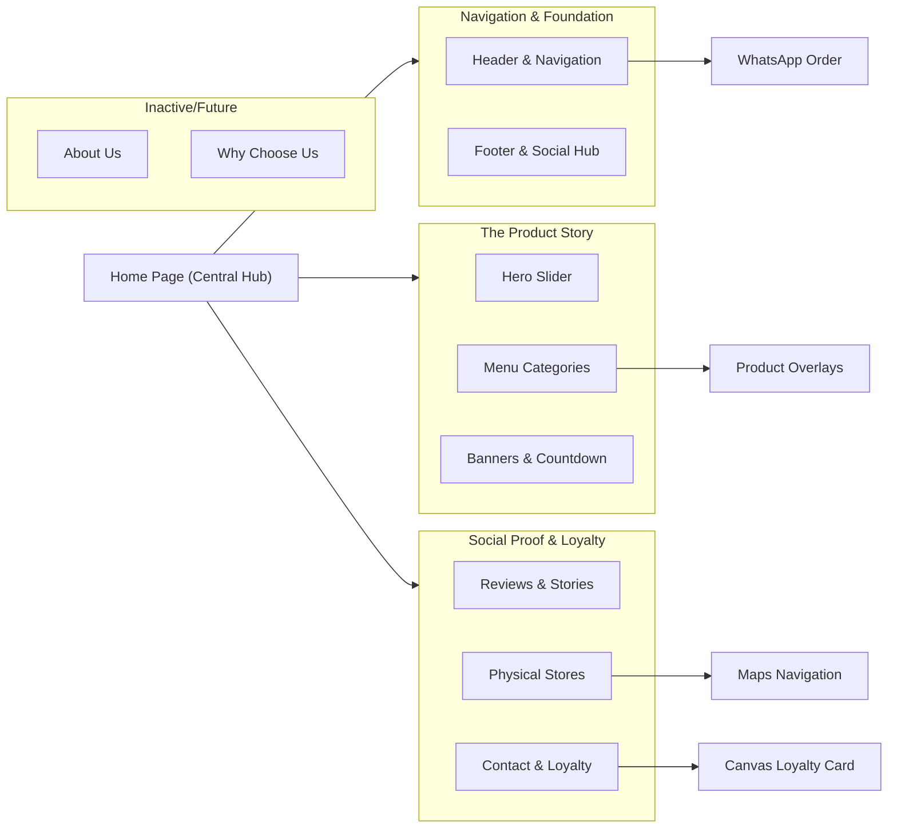

This document provides a comprehensive overview of the **2Go Fresh Beverage Brand** website, including its architecture, user journey, functional logic, and design philosophy.

---

## 🗺️ Visual Sitemap

```mermaid
graph LR
    Home["Home Page (Central Hub)"] --> Global["Global Elements"]
    Home --> Brand["The Brand Experience"]
    Home --> Interaction["User Interaction"]

    subgraph Global ["Navigation & Foundation"]
        Header[Header & Navigation]
        Footer[Footer & Social Hub]
    end

    subgraph Brand ["The Product Story"]
        Hero[Hero Slider]
        Cats[Menu Categories]
        Deals[Banners & Countdown]
    end

    subgraph Interaction ["Social Proof & Loyalty"]
        Social[Reviews & Stories]
        Locs[Physical Stores]
        Contact[Contact & Loyalty]
    end

    %% Key Relationships
    Header --> WA[WhatsApp Order]
    Cats --> Over[Product Overlays]
    Locs --> Map[Maps Navigation]
    Contact --> Canvas[Canvas Loyalty Card]

    subgraph "Inactive/Future"
        AB[About Us]
        WCU[Why Choose Us]
    end
```

## 🏗️ Sitemap & Architecture

The website is a **Single Page Application (SPA)** built with Next.js, optimized for high-conversion and visual storytelling.

### 1. **Header** (Global Controller)

- **Dynamic Transition**: Shifts from transparent to solid white with a glassmorphism shadow on scroll.
- **CTAs**: Integrated WhatsApp and Direct Call buttons for frictionless ordering.
- **Navigation**: "Smart" links using anchor tags for smooth intra-page transitions.

### 2. **Hero Section** (Brand First Impression)

- **Dynamic Slider**: Powered by Swiper.js, featuring parallax-style floating fruit/bottle assets.
- **Visual Hooks**: Premium typography (Urbanist) with high-contrast positioning.

### 3. **Categories** (Menu Engine)

- **Interactive Grid**: Uses CSS `backdrop-blur-2xl` for a high-end feel.
- **Logic**:
  - Client-side filtering of products (Juices, Shakes, Coffee).
  - Scroll-locked overlays for detailed product specs (ingredients, price, special notes).
  - Esc-key and click-outside triggers for intuitive UX.

### 4. **Banners** (Conversion Utility)

- **Mastermind Deal**: Features a real-time JS countdown timer (`setInterval` based) to create urgency.
- **Micro-interactions**: Subtle hover scaling and glassmorphism depth.

### 5. **Reviews & Social Proof**

- **Dynamic Grid**: Randomized accent colors for each review card.
- **Video Elements**: Simulated video players using HTML/CSS wave-animations to build authenticity without heavy video loads.

### 6. **Locations** (Physical Presence)

- **Visual Wayfinding**: High-resolution imagery of physical store fronts.
- **Direct Navigation**: Deep-linking to Google Maps coordinates.

### 7. **Social & Contact Hub**

- **Social Embeds**: Clean grid of social media entry points.
- **Contact System**: Validation-ready form feeding into the Loyalty card logic.

### 8. **Loyalty System** (Retention Engine)

- **Personalized Logic**: Upon form submission, the site generates a high-definition (2x scale) membership card.
- **Engine**: Uses HTML5 Canvas API to render custom user data onto an image template for instant download.

---

## 🚶 User Journey

### Phase 1: High-Impact Entrance (Home)

The user is greeted by the **Hero Slider**. Floating fruit bottles and large geometric splashes communicate "Fresheness" and "Premium Craftsmanship" within 2 seconds of page load.

### Phase 2: Menu Discovery (Categories)

The user scrolls to **Categories**. The interaction allows them to filter products instantly. Clicking a bottle triggers a sleek overlay, revealing the "Real Fruit" ingredients and special health notes, moving them from curiosity to intent.

### Phase 3: Validation & Urgency (Reviews & Banners)

The user sees the **Reviews** (building trust) and then the **Mastermind Deal** with its ticking clock. The combination of social proof and scarcity (time-limited deal) drives the decision to order.

### Phase 4: Seamless Conversion (WhatsApp/Call)

The user clicks the **WhatsApp CTA** found in the Header or Banner. This bypasses a complex cart system for a direct, personalized chat-to-order experience, which is culturally preferred in the target market.

### Phase 5: Enrollment (Contact/Loyalty)

Post-order, the user fills out the contact form to stay "Fresh." The instant generation of a **Personalized Loyalty Card** serves as a digital "gift," increasing the likelihood of return visits to physical stores.

---

---

## ⚙️ Core Functionality & Logic

### **1. Seamless Asset Delivery**

The website uses an intelligent asset management system that ensures all high-resolution brand imagery loads perfectly regardless of where the site is hosted. This provides a consistent experience for users worldwide, maintaining the brand's premium look and feel.

### **2. Personalized Loyalty Engine**

A key feature is the instant generation of loyalty cards. When a user joins the family through our contact portal, the system automatically crafts a personalized digital membership card. This "instant reward" serves as a digital gift, encouraging repeat visits and building a community of "Fresh" enthusiasts.

### **3. Immersive Interactive Flow**

The site is designed to feel alive. As the user scrolls, components react with fluid animations (revealing, sliding, and scaling). This isn't just for show; it guides the user's focus through the brand story and ensures the discovery process feels premium and engaging.

### **4. Real-time Offer System**

To keep the menu exciting, certain premium deals feature live countdowns. This creates a dynamic sense of urgency for special limited-time offerings, keeping the user journey focused on immediate value and freshness.

---

## 🎨 Design System & Styles

### **Colors**

| Token         | HEX       |                         Preview                          | Role                           |
| :------------ | :-------- | :------------------------------------------------------: | :----------------------------- |
| **Primary**   | `#d64c4c` | ■ | Signature Red (Energy, Fruit)  |
| **Secondary** | `#307351` | ■ | Forest Green (Natural, Health) |
| **Yellow**    | `#F3CA40` | ■ | Honey Yellow (Zest, Deals)     |
| **Dark**      | `#1a1a1a` | ■ | Premium Contrast (Luxury)      |

### **Typography**

- **Urbanist**: Used for all weights (300-900). Geometric sans-serif that reflects cleanliness and modern beverage branding.
- **Noto Sans Bengali**: Paired perfectly for local language support without sacrificing the clean aesthetic.

### **Visual Pillars**

- **Glassmorphism**: Heavy use of `backdrop-blur` and semi-transparent white overlays to create layers of depth.
- **Organic Depth**: Utilizing `shadow-inner` and multi-layered drop shadows to make digital cards feel like physical objects.
- **Micro-Animations**: Hover-triggered rotations, pulse effects, and stagger-loaded grids.
